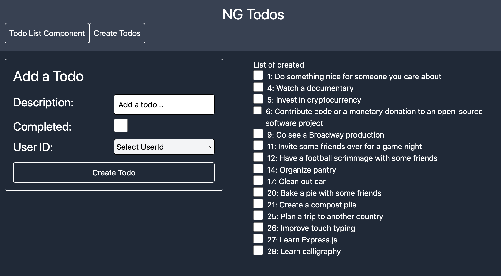
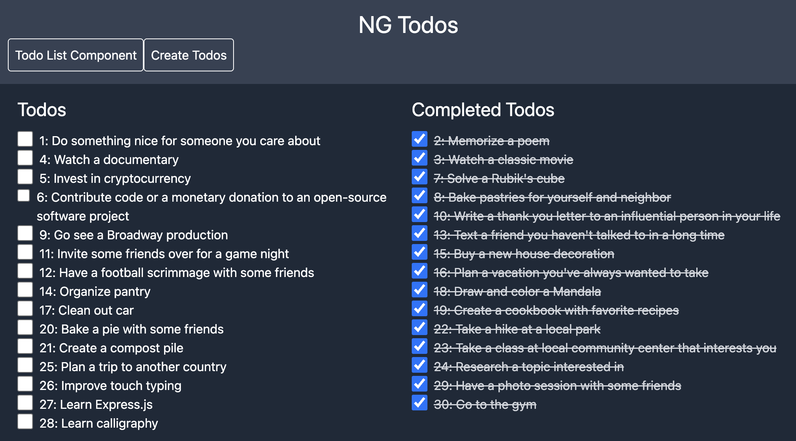

# TodosNg

An Angular todo application built to practice NgRx state management. This project demonstrates reading from and writing to a centralized app store using NgRx patterns.

## Features
- ✅ Create and manage todos
- 🔄 Real-time state management with NgRx
- 📊 Filter todos by status (complete/incomplete)
- 🎨 Modern UI with Tailwind CSS
- 🚀 Reactive forms with validation

This app is a work in progress with ongoing development of additional NgRx features and functionality.





## Development server

To start a local development server, run:

```bash
ng serve
```

Once the server is running, open your browser and navigate to `http://localhost:4200/`. The application will automatically reload whenever you modify any of the source files.
